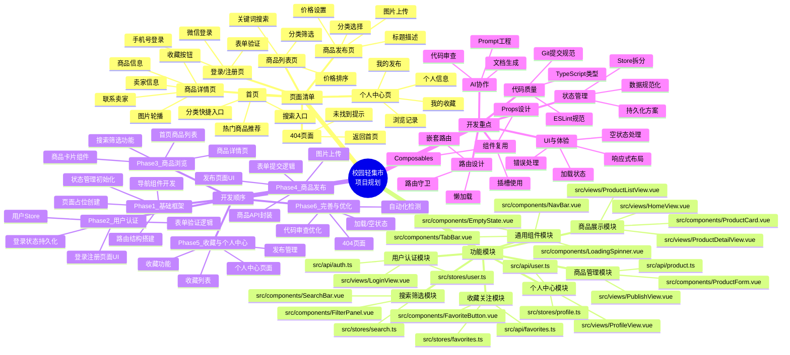
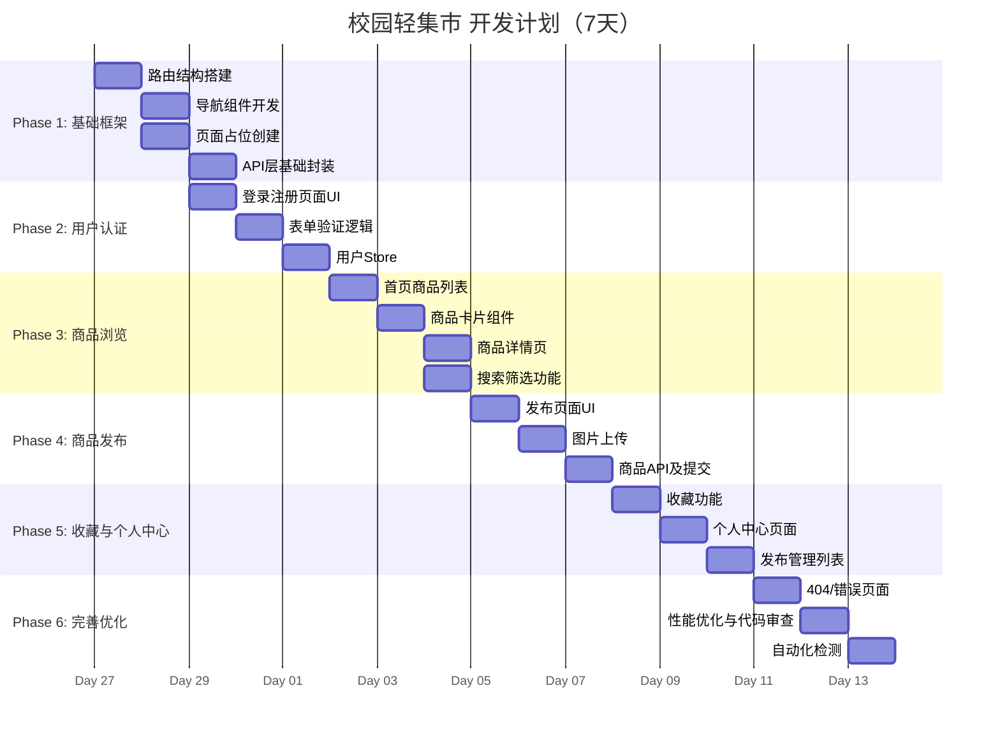
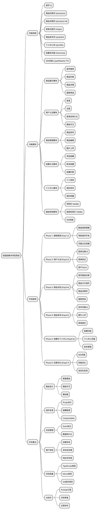

# Day 1 Process Evidence

---

## Task 1: 项目背景理解

### 阅读课程资料

课程资料《实训方案》《需求分析》《技术架构》《实训计划》位于教师发布的《校园轻集市项目指导书》中。

---

### 思考题

#### 1. 为什么要开发校园轻集市？

校园轻集市是一个 **Vue 3 前端工程化实践教学项目**，开发它的目的有以下几点：

- **教学实践载体**：通过开发一个真实的"校园二手交易/轻集市"前端应用，让学生在动手实践中掌握 Vue 3 工程化开发技能，而不是停留在理论学习层面。
- **体验真实软件工程流程**：课程模拟了完整的项目开发过程，涵盖需求分析、技术架构设计、编码实现、Git 版本管理、过程性证据记录、项目验收等环节。
- **培养 AI Coding 协作能力**：课程鼓励合理使用 AI 辅助开发工具（如 GitHub Copilot、Cursor 等），并记录 AI 协作过程，培养学生与 AI 高效协作的能力。
- **建立工程化规范意识**：通过统一的环境基线（nvm、pnpm、ESLint、EditorConfig 等），让学生理解团队协作中统一开发环境的重要性。

#### 2. 系统主要解决哪些实际问题？

校园轻集市系统主要解决以下校园场景中的实际问题：

- **闲置物品流通**：学生在校园内存在大量闲置物品（教材、电子产品、生活用品等），需要一个便捷的平台进行二手交易，实现资源再利用。
- **信息不对称**：传统校园交易依赖公告栏、QQ群、微信群等渠道，信息分散、难以检索，系统提供集中式的信息发布与浏览平台。
- **交易信任问题**：校内交易相比校外平台更具信任基础，系统服务于校内用户群体，降低了交易风险。
- **交易效率低下**：通过线上展示、搜索、分类等功能，提高买卖双方的匹配效率。

#### 3. 系统包含哪些业务场景？

根据项目技术架构（Vue 3 + Vue Router + Pinia）和源码目录规划（`src/views/`、`src/components/`、`src/api/`、`src/stores/`），系统预计包含以下业务场景：

| 业务场景 | 说明 |
| -------- | ---- |
| **首页/商品浏览** | 展示商品列表，支持浏览热门/推荐商品 |
| **商品搜索与筛选** | 按分类、关键词、价格等条件筛选商品 |
| **商品详情** | 查看商品详细信息、图片、卖家信息 |
| **用户注册/登录** | 校园用户身份认证 |
| **商品发布** | 卖家发布闲置物品信息（标题、描述、价格、图片等） |
| **个人中心** | 管理个人信息、查看已发布/已购买的商品 |
| **收藏/关注** | 收藏感兴趣的商品，关注卖家 |

#### 4. 七天实训最终要完成什么？

根据实训计划（7 天），最终需要完成以下成果：

| 天数 | 任务重点 |
| ---- | -------- |
| **Day 1** | 项目背景理解、环境搭建、项目启动 |
| **Day 2** | 页面结构与路由设计 |
| **Day 3** | 组件开发 |
| **Day 4** | 状态管理与数据交互 |
| **Day 5** | 功能完善与联调 |
| **Day 6** | 测试、优化与自动化检测 |
| **Day 7** | 项目验收、证据整理与总结 |

**最终交付物：**
- 一个完整可运行的 Vue 3 校园轻集市前端应用
- 每日过程性证据文档（Day1~Day7 Evidence）
- AI 协作记录卡
- 规范的 Git 提交历史
- 通过自动检测工具（Check Engine）的验证

---

## Task 2: 浏览项目目录结构

### 项目完整目录树

```
campus-market-seed/
├── .vscode/               # VS Code 工作区配置
│   └── settings.json      # 统一编辑器设置
├── docs/                  # 课程文档
│   ├── ai/                # AI 协作规范
│   │   └── AI_Collaboration_Card.md
│   ├── evidence/          # 每日过程性证据模板
│   │   ├── Day1_Evidence.md
│   │   ├── Day2_Evidence.md
│   │   ├── ...
│   │   └── Day7_Evidence.md
│   └── guide/             # 学生使用指南
│       ├── Environment_Setup.md
│       └── Getting_Started.md
├── public/                # 静态资源（不经过编译）
│   └── favicon.ico
├── scripts/               # 自动检测工具脚本（后续启用）
│   └── .gitkeep
├── src/                   # ⭐ 项目源码（核心开发目录）
│   ├── api/               # API 接口层
│   │   └── .gitkeep
│   ├── components/        # 可复用组件
│   │   └── .gitkeep
│   ├── router/            # 路由配置
│   │   └── index.ts
│   ├── stores/            # Pinia 状态管理
│   │   └── .gitkeep
│   ├── views/             # 页面视图
│   │   └── HomeView.vue
│   ├── App.vue            # 根组件
│   └── main.ts            # 应用入口文件
├── .editorconfig          # 编辑器格式统一配置
├── .gitattributes         # Git 文件属性
├── .gitignore             # Git 忽略规则
├── .nvmrc                 # Node.js 版本声明 → 24.12.0
├── .oxlintrc.json         # Oxlint 规则配置
├── CHECK_REPORT.md        # 自动检测报告（后续生成）
├── env.d.ts               # TypeScript 环境类型声明
├── eslint.config.ts       # ESLint 规则配置
├── index.html             # HTML 入口文件
├── package.json           # 项目依赖与 npm scripts
├── pnpm-lock.yaml         # 依赖版本锁定文件
├── README.md              # 项目说明文档
├── tsconfig.json          # TypeScript 总配置
├── tsconfig.app.json      # 应用代码 TS 配置
├── tsconfig.node.json     # Node 端 TS 配置
├── VERSION.md             # 版本信息
└── vite.config.ts         # Vite 构建工具配置
```

---

### 思考题

#### 1. 为什么采用这种目录结构？

项目采用 Vue 3 生态社区推荐的**按功能/职责分层**的工程化目录结构，原因如下：

| 设计原则 | 说明 |
| -------- | ---- |
| **关注点分离** | `views/`（页面）、`components/`（组件）、`stores/`（状态）、`api/`（数据）各司其职，修改某一层不影响其他层 |
| **约定优于配置** | 遵循 Vue 3 + Vite 生态的目录约定，开发者无需额外学习即可快速上手 |
| **可维护性** | 目录按职责划分，当项目规模增长时，新增文件有明确的归属位置，不会混乱 |
| **团队协作友好** | 多人同时开发不同模块时，各自在对应目录下工作，减少 Git 冲突 |
| **渐进式扩展** | 初期目录精简（仅 7 个核心目录），后续可按需扩展（如添加 `utils/`、`hooks/`、`types/` 等），不会被框架目录束缚 |
| **工具链兼容** | Vite 的 `@` 别名指向 `src/`，所有源码统一在 `src/` 下，构建工具和编辑器都能正确解析 |

#### 2. 每个目录负责什么？

**核心开发目录（src/）：**

| 目录/文件 | 职责 | 当前状态 |
| --------- | ---- | -------- |
| `src/api/` | **API 接口层** — 封装与后端通信的 HTTP 请求（axios/fetch），每个 API 模块对应一个文件 | `.gitkeep`（空目录，待开发） |
| `src/components/` | **可复用组件** — 存放跨页面共享的 UI 组件（如商品卡片、导航栏、搜索框等） | `.gitkeep`（空目录，待开发） |
| `src/router/` | **路由配置** — 定义页面 URL 与视图组件的映射关系，管理页面导航 | 已有 `index.ts`（仅配置了首页路由 `/`） |
| `src/stores/` | **状态管理** — 使用 Pinia 管理全局共享状态（用户信息、购物车、商品列表等） | `.gitkeep`（空目录，待开发） |
| `src/views/` | **页面视图** — 每个路由对应的顶层页面组件（如首页、商品详情页、登录页等） | 已有 `HomeView.vue`（仅展示"项目启动成功"） |
| `src/App.vue` | **根组件** — 整个应用的布局骨架，包含标题栏和 `<RouterView />` 插槽 | 已有基础结构 |
| `src/main.ts` | **应用入口** — 创建 Vue 实例，注册 Pinia、Router 等插件，挂载到 `#app` | 已完成 |

**课程基础设施目录：**

| 目录/文件 | 职责 |
| --------- | ---- |
| `docs/guide/` | 学生使用指南（环境配置、快速开始） |
| `docs/evidence/` | 每日过程性证据模板（Day1~Day7） |
| `docs/ai/` | AI 协作记录规范 |
| `public/` | 静态资源，直接复制到构建输出，不经过 Vite 编译 |
| `scripts/` | 自动检测工具脚本（后续版本启用 Check Engine） |

**工程化配置文件（根目录）：**

| 文件 | 职责 |
| ---- | ---- |
| `package.json` | 项目元信息、依赖声明、npm scripts |
| `vite.config.ts` | Vite 构建配置（插件、路径别名 `@` → `src/`） |
| `tsconfig*.json` | TypeScript 编译选项 |
| `eslint.config.ts` | ESLint 代码规范检查规则 |
| `.oxlintrc.json` | Oxlint 快速检查规则 |
| `.editorconfig` | 统一缩进、编码、换行符（2空格、UTF-8、LF） |
| `.gitignore` | Git 忽略规则（node_modules、dist、.env 等） |
| `.nvmrc` | 声明 Node.js 版本 → `24.12.0` |
| `index.html` | SPA 入口 HTML，Vite 构建的挂载点 |

#### 3. 哪些目录需要自己开发？

**需要学生自己开发的目录：**

| 目录 | 开发内容 |
| ---- | -------- |
| `src/views/` | 创建所有页面视图（首页、详情页、登录页、发布页、个人中心等） |
| `src/components/` | 开发可复用 UI 组件（商品卡片、导航栏、搜索栏、表单等） |
| `src/router/` | 扩展路由配置，添加各页面的路由映射 |
| `src/stores/` | 定义 Pinia Store，管理用户状态、商品状态、购物车等 |
| `src/api/` | 封装后端 API 请求函数 |
| `docs/evidence/` | 填写每日过程性证据文档 |

#### 4. 哪些目录属于课程基础设施？

**课程基础设施（由教师/仓库提供，学生不应修改或仅限参考）：**

| 目录/文件 | 角色 | 说明 |
| --------- | ---- | ---- |
| `.nvmrc` | 🔒 基础设施 | 统一 Node.js 版本，保证全员环境一致 |
| `package.json` | 🔒 基础设施 | `packageManager` 锁定 pnpm 版本，`engines` 限制 Node 版本 |
| `.editorconfig` | 🔒 基础设施 | 统一缩进、编码、换行符格式 |
| `.gitignore` | 🔒 基础设施 | 统一版本管理规则，避免提交构建产物和依赖 |
| `.vscode/settings.json` | 🔒 基础设施 | 推荐的 VS Code 配置（自动保存、格式化等） |
| `tsconfig*.json` | 🔒 基础设施 | TypeScript 编译选项基线 |
| `eslint.config.ts` | 🔒 基础设施 | 代码质量检查规则 |
| `.oxlintrc.json` | 🔒 基础设施 | 快速 Lint 检查规则 |
| `vite.config.ts` | 🔒 基础设施 | 构建配置与路径别名 `@` |
| `env.d.ts` | 🔒 基础设施 | Vite 客户端类型声明 |
| `index.html` | 🔒 基础设施 | SPA 入口 |
| `docs/guide/` | 📖 参考文档 | 环境配置与快速开始指南 |
| `docs/ai/` | 📖 参考文档 | AI 协作规范 |
| `docs/evidence/` | 📖 模板（只读） | 过程性证据模板框架 |
| `scripts/` | 🔧 后续启用 | 自动检测工具（Check Engine） |
| `public/` | 🔒 基础设施 | 静态资源目录（可添加自己的资源） |

> **结论**：学生开发的焦点在 `src/` 下的 5 个核心目录（`api/`、`components/`、`router/`、`stores/`、`views/`）+ `docs/evidence/`。其余配置文件和文档属于课程基础设施，统一提供以保证全员开发环境和规范的一致性——这也模拟了真实企业中"架构组提供脚手架，业务团队在上层开发"的分工模式。

---

---

## Task 3: 阅读核心代码

### 3.1 阅读 `src/main.ts`

#### 源码

```ts
import { createApp } from 'vue'
import { createPinia } from 'pinia'

import App from './App.vue'
import router from './router'

const app = createApp(App)

app.use(createPinia())
app.use(router)

app.mount('#app')
```

#### 执行流程图

```
createApp(App)           →  创建 Vue 应用实例，指定 App.vue 为根组件
       │
       ▼
app.use(createPinia())   →  注册 Pinia 插件，全局状态管理能力就绪
       │
       ▼
app.use(router)          →  注册 Vue Router 插件，页面路由能力就绪
       │
       ▼
app.mount('#app')        →  挂载到 index.html 中的 <div id="app">
                            Vue 接管该 DOM 节点，应用开始运行
```

#### 思考

**Q1: Vue 应用如何创建？**

通过 `createApp(App)` 创建应用实例。`createApp` 是 Vue 3 的工厂函数，接收一个根组件（`App.vue`）作为参数，返回一个 Vue 应用实例。这个实例是 Vue 应用的"根"，后续所有插件、组件都挂载在它上面。

**Q2: Pinia 如何注册？**

通过 `app.use(createPinia())` 注册：
- `createPinia()` 创建 Pinia 实例
- `app.use()` 是 Vue 的插件安装方法，将 Pinia 注入整个应用
- 注册后，所有组件内都可以通过 `useXxxStore()` 访问 Pinia Store

**Q3: Router 如何注册？**

通过 `app.use(router)` 注册：
- `router` 是从 `./router/index.ts` 导入的已配置好的 Router 实例
- 同样是插件模式——`app.use()` 将 Router 注入整个应用
- 注册后，所有组件内可通过 `useRouter()` / `useRoute()` 访问路由功能

**Q4: 项目入口在哪里？**

整个入口链条为：

```
index.html 中的 <script type="module" src="/src/main.ts">
       │
       ▼
src/main.ts            ← JavaScript/TypeScript 逻辑入口
       │
       ▼
src/App.vue            ← 根组件（UI 入口）
       │
       ▼
<RouterView />         ← 路由视图，渲染当前 URL 对应的页面组件
```

> `index.html` 是 Vite 的物理入口，`main.ts` 是 JS 逻辑入口，`App.vue` 是组件树的根。

---

### 3.2 阅读 `src/router/index.ts`

#### 源码

```ts
import { createRouter, createWebHistory } from 'vue-router'
import HomeView from '@/views/HomeView.vue'

const router = createRouter({
  history: createWebHistory(import.meta.env.BASE_URL),
  routes: [
    {
      path: '/',
      name: 'home',
      component: HomeView,
    },
  ],
})

export default router
```

#### 路由配置解析

| 配置项 | 值 | 说明 |
| ------ | --- | ---- |
| `history` | `createWebHistory(…)` | 使用 HTML5 History 模式，URL 干净无 `#` 号 |
| `path: '/'` | 根路径 | 匹配 `http://localhost:5173/` |
| `name: 'home'` | 命名路由 | 可通过名称跳转，而非硬编码路径 |
| `component` | `HomeView` | 指定渲染的视图组件 |

#### 思考

**Q1: Router 的作用是什么？**

Vue Router 是 Vue 3 的官方路由管理器，核心作用：

- **URL ↔ 视图映射**：根据浏览器 URL 决定显示哪个页面组件，无需刷新页面（SPA 单页应用的核心）
- **页面导航**：提供 `<RouterLink>` 和 `router.push()` 等 API 实现页面跳转
- **历史管理**：通过 `createWebHistory` 利用浏览器 History API，支持前进/后退
- **代码分割**：结合 `import()` 动态导入，实现按路由懒加载，减小首屏体积

**Q2: 为什么首页能够显示？**

三个环节共同作用：

```
1. 路由匹配
   URL: http://localhost:5173/
   路由表: { path: '/', component: HomeView }
   → '/' 匹配成功，Router 决定渲染 HomeView

2. App.vue 提供插槽
   <RouterView />  ← 路由匹配到的组件会被渲染到这里

3. 浏览器访问
   用户打开 http://localhost:5173/
   → Vite 返回 index.html
   → 加载 main.ts → 创建 App → 注册 Router
   → Router 解析当前 URL '/' → 匹配 HomeView
   → HomeView 渲染到 <RouterView /> 位置
   → 页面显示 "项目启动成功"
```

> 当前项目只有 `/` 一个路由，访问任何未匹配路径都不会显示内容（后续需要添加 404 页面）。

---

### 3.3 阅读 `src/App.vue`

#### 源码

```html
<script setup lang="ts"></script>

<template>
  <main class="app">
    <h1>校园轻集市</h1>
    <p>AI 辅助前端工程实践种子项目</p>
    <RouterView />
  </main>
</template>

<style scoped>
.app {
  padding: 32px;
}
</style>
```

#### 结构分析

| 区块 | 内容 | 作用 |
| ---- | ---- | ---- |
| `<script setup>` | （空） | 组件逻辑（当前无逻辑，后续可在此引入状态、API 等） |
| `<template>` | `<h1>` + `<p>` + `<RouterView />` | 页面骨架：标题栏 + 路由视图插槽 |
| `<style scoped>` | `padding: 32px` | scoped 样式，`scoped` 确保只作用于本组件 |

#### 思考

**Q: App.vue 在整个项目中的作用是什么？**

`App.vue` 是 Vue 应用的**根组件**，扮演着整个应用的**布局骨架**角色：

| 角色 | 说明 |
| ---- | ---- |
| 🏗️ **组件树根节点** | 所有页面和组件都是 App.vue 的子节点，它是整个组件树的起点 |
| 🖼️ **全局布局框架** | 提供应用级的外壳（标题 "校园轻集市"、全局样式等），这些内容在所有页面上都可见 |
| 🔌 **路由插槽** | `<RouterView />` 是核心——它是一个占位符，当前 URL 匹配到的页面组件会动态渲染到这个位置 |
| 📦 **全局提供者** | 后续可在此层注入全局数据、主题、对话框等——所有子组件都能访问 |
| 🎨 **全局样式基准** | 在此处定义的全局类（如 `.app`）可作为全应用的布局基准 |

#### 页面渲染模型

```
┌──────────────────────────────────┐
│  App.vue                         │
│  ┌────────────────────────────┐  │
│  │  <h1>校园轻集市</h1>       │  │  ← 全局：所有页面都显示
│  │  <p>种子项目</p>            │  │  ← 全局：所有页面都显示
│  │  ┌──────────────────────┐  │  │
│  │  │  <RouterView />      │  │  │  ← 动态：根据 URL 切换
│  │  │  ┌────────────────┐  │  │  │
│  │  │  │  HomeView      │  │  │  │  ← URL = '/' 时渲染
│  │  │  │  项目启动成功   │  │  │  │
│  │  │  └────────────────┘  │  │  │
│  │  │  或                  │  │  │
│  │  │  ┌────────────────┐  │  │  │
│  │  │  │  其他页面组件   │  │  │  │  ← URL 变化时切换
│  │  │  └────────────────┘  │  │  │
│  │  └──────────────────────┘  │  │
│  └────────────────────────────┘  │
└──────────────────────────────────┘
```

---

## Day 1 总结

通过今天三个 Task 的学习，完成了对校园轻集市项目的**全景认知**：

| Task | 核心收获 |
| ---- | -------- |
| Task 1 项目背景理解 | 明确了"做什么"——校园二手交易平台，7 天完成 Vue 3 前端开发 |
| Task 2 目录结构分析 | 明确了"哪里做"——核心在 `src/` 的 5 个目录，其余是基础设施 |
| Task 3 核心代码阅读 | 明确了"怎么跑起来的"——`main.ts` 创建实例 → 注册插件 → 挂载，`RouterView` 驱动页面切换 |

**下一步（Day 2 预告）**：页面结构与路由设计——开始往 `src/views/` 和 `src/router/` 中添加新页面。

---

---

## Task 4: AI 协作体验

### 📝 Prompt（向 AI 提出的问题）

```
请 AI 完成以下分析任务：

1. 分析项目目录结构 — 说明每个目录和关键文件的职责
2. 解释 main.ts — Vue 应用的创建流程
3. 解释 Router 的作用 — 以及首页为什么能显示
4. 分析当前项目采用的技术栈 — 列出所有技术及其在项目中的角色
```

---

### 🤖 AI 输出

#### 1. 项目目录结构分析

```
campus-market-seed/
│
├── 📄 工程化配置文件（根目录） — 课程基础设施，统一开发基线
│   ├── package.json          → 项目元信息、依赖声明、npm scripts（dev/build/lint）
│   ├── vite.config.ts        → Vite 构建配置，定义插件和 @ 路径别名
│   ├── tsconfig*.json        → TypeScript 编译选项（分 app 和 node 两端）
│   ├── eslint.config.ts      → ESLint 代码规范（变量命名、未使用变量等）
│   ├── .oxlintrc.json        → Oxlint 快速检查（比 ESLint 更快）
│   ├── .editorconfig         → 编辑器格式统一（2空格缩进、UTF-8、LF换行）
│   ├── .nvmrc                → Node.js 版本声明 → 24.12.0
│   ├── .gitignore            → Git 忽略规则（node_modules、dist、.env等）
│   ├── env.d.ts              → Vite 客户端 TypeScript 类型声明
│   └── index.html            → SPA 的 HTML 入口，Vite 构建的挂载点
│
├── 📁 src/ — ⭐ 核心开发目录，所有业务代码在此编写
│   ├── api/                  → API 接口层：封装 HTTP 请求，与后端通信
│   ├── components/           → 可复用组件：跨页面共享的 UI 组件
│   ├── router/               → 路由配置：URL ↔ 页面组件的映射关系
│   ├── stores/               → 状态管理：Pinia Store，管理全局共享数据
│   ├── views/                → 页面视图：每个路由对应的顶层页面组件
│   ├── App.vue               → 根组件：全局布局骨架 + <RouterView /> 插槽
│   └── main.ts               → 应用入口：创建实例 → 注册插件 → 挂载 DOM
│
├── 📁 docs/ — 课程文档
│   ├── guide/                → 学生使用指南（环境配置、快速开始）
│   ├── evidence/             → 每日过程性证据模板（Day1~Day7）
│   └── ai/                   → AI 协作记录规范
│
├── 📁 public/                → 静态资源，直接复制到构建输出
├── 📁 scripts/               → 自动检测工具（Check Engine，后续启用）
└── 📁 .vscode/               → VS Code 工作区推荐配置
```

**设计思想**：按功能职责分层，遵循 Vue 3 生态约定。`api/`、`components/`、`stores/`、`views/`、`router/` 各司其职，修改一层不影响其他层。项目初期精简，后续可按需扩展 `utils/`、`hooks/`、`types/` 等。

---

#### 2. 解释 main.ts — Vue 应用创建流程

```ts
import { createApp } from 'vue'       // ① 导入 Vue 3 的 createApp 工厂函数
import { createPinia } from 'pinia'   // ② 导入 Pinia 的 createPinia 工厂函数

import App from './App.vue'           // ③ 导入根组件
import router from './router'         // ④ 导入已配置好的路由实例

const app = createApp(App)            // ⑤ 创建 Vue 应用实例

app.use(createPinia())                // ⑥ 安装 Pinia 插件（全局状态管理）
app.use(router)                       // ⑦ 安装 Router 插件（页面路由）

app.mount('#app')                     // ⑧ 挂载到 DOM，接管 <div id="app">
```

**执行链条**：

```
createApp(App)           →  第 5 行：以 App.vue 为根组件创建 Vue 应用实例
       │                    此时应用尚未激活，组件不会渲染
       ▼
app.use(createPinia())   →  第 6 行：Pinia 是 Vue 的插件，通过 use() 安装
       │                    安装后，所有组件可通过 useXxxStore() 访问 Store
       ▼
app.use(router)          →  第 7 行：Router 同样是 Vue 插件
       │                    安装后，<RouterView> 和 useRouter() 才能工作
       ▼
app.mount('#app')        →  第 8 行：真正的启动点！
                             Vue 找到 index.html 中的 <div id="app">
                             将 App.vue 的模板渲染进去
                             此时应用开始运行，页面可见
```

> **关键理解**：在 `mount()` 调用之前，所有 `use()` 只是"注册"插件，不会触发渲染。`mount()` 是最后一步，触发整个组件树的首次渲染。

---

#### 3. 解释 Router 的作用

Vue Router 的核心职责是**实现 URL 与页面视图的映射**，让单页应用（SPA）拥有多页面般的导航体验。

**三大核心作用**：

| 作用 | 说明 | 对应 API |
|------|------|----------|
| 🗺️ **路由映射** | 定义 URL 路径和页面组件的一一对应关系 | `routes: [{ path: '/', component: HomeView }]` |
| 🧭 **页面导航** | 不刷新浏览器实现页面跳转 | `<RouterLink>` 或 `router.push()` |
| 🪟 **视图渲染** | 在指定位置动态渲染当前匹配的组件 | `<RouterView />` |

**首页为什么能显示？完整流程**：

```
浏览器输入 http://localhost:5173/
        │
        ▼
Vite 开发服务器 返回 index.html
        │
        ▼
浏览器加载 <script src="/src/main.ts">
        │
        ▼
main.ts: createApp(App) → use(router) → mount('#app')
        │
        ▼
Router 解析当前 URL 路径 → '/'
        │
        ▼
遍历路由表 → 匹配 { path: '/', name: 'home', component: HomeView }
        │
        ▼
将 HomeView 组件渲染到 App.vue 中的 <RouterView /> 位置
        │
        ▼
用户看到 → "校园轻集市" + "项目启动成功"
```

> 当前只有 `/` 一个路由。访问任何不匹配的路径，`<RouterView />` 中为空——后续需添加通配路由（404 页面）处理未匹配路径。

**路由模式对比**：

| 模式 | URL 示例 | 特点 |
|------|---------|------|
| `createWebHistory` ✅ | `http://localhost:5173/product/123` | HTML5 History API，URL 干净美观，需服务器配合 |
| `createWebHashHistory` | `http://localhost:5173/#/product/123` | Hash 模式，兼容性好，无需服务器配置 |

当前项目使用 `createWebHistory`。

---

#### 4. 当前项目技术栈分析

**运行时依赖（生产环境）**：

| 技术 | 版本 | 在项目中的角色 |
|------|------|--------------|
| **Vue 3** | ^3.5.38 | 🏗️ 核心框架 — 响应式 UI、组件系统、Composition API |
| **Vue Router** | ^5.1.0 | 🧭 路由管理 — URL ↔ 页面映射、SPA 导航 |
| **Pinia** | ^3.0.4 | 📦 状态管理 — 全局数据共享（用户信息、商品列表等） |
| **TypeScript** | ~6.0.0 | 🔒 类型系统 — 编译时类型检查、代码提示、重构支持 |

**开发依赖（仅开发环境）**：

| 技术 | 版本 | 在项目中的角色 |
|------|------|--------------|
| **Vite** | ^8.0.16 | ⚡ 构建工具 — 极速冷启动、HMR 热更新、生产打包 |
| **ESLint** | ^10.5.0 | ✅ 代码规范检查 — 变量命名、未使用变量、类型错误 |
| **Oxlint** | ~1.69.0 | 🚀 快速 Lint — 比 ESLint 快 50-100 倍的补充检查 |
| **vue-tsc** | ^3.3.5 | 🔍 Vue 模板类型检查 — 验证 template 中的 TypeScript 类型 |
| **Vite Plugin Vue** | ^6.0.7 | 🔌 Vite 的 Vue SFC 编译插件（解析 .vue 单文件组件） |
| **Vue DevTools** | ^8.1.2 | 🛠️ 浏览器开发者工具集成 |

**工具链（不在 package.json 中，但属于项目设施）**：

| 工具 | 用途 |
|------|------|
| **nvm** | Node.js 版本管理器，确保全员使用 24.12.0 |
| **pnpm** | 快速、节省磁盘的包管理器，通过 `packageManager` 字段锁定 11.9.0 |
| **Corepack** | Node.js 内置的包管理器启用工具，自动使用项目指定的 pnpm 版本 |
| **Git** | 版本管理，记录开发过程 |

**技术栈架构图**：

```
┌─────────────────────────────────────────────────────┐
│                    浏览器 / 用户                      │
├─────────────────────────────────────────────────────┤
│  Vue 3 (UI 框架)                                     │
│  ├── Vue Router (页面导航)                           │
│  ├── Pinia (全局状态)                                │
│  └── 自定义组件 (components/ + views/)               │
├─────────────────────────────────────────────────────┤
│  TypeScript (类型安全层)                              │
├─────────────────────────────────────────────────────┤
│  Vite (构建工具层)                                    │
│  ├── 开发服务器 (HMR 热更新)                         │
│  ├── 生产构建 (Rollup 打包)                          │
│  └── 插件系统 (Vue SFC 编译、DevTools)               │
├─────────────────────────────────────────────────────┤
│  质量保障层                                          │
│  ├── ESLint (代码规范)                               │
│  ├── Oxlint (快速检查)                               │
│  └── vue-tsc (模板类型检查)                          │
├─────────────────────────────────────────────────────┤
│  基础设施                                            │
│  ├── Node.js 24.12.0 (运行时)                        │
│  ├── pnpm 11.9.0 (包管理)                            │
│  └── Git (版本管理)                                  │
└─────────────────────────────────────────────────────┘
```

---

### ✍️ 自己的理解

> *（请在此处用自己的语言总结：你从以上 AI 分析中学到了什么？哪些概念之前不清楚现在清楚了？哪些地方还需要进一步学习？）*

| 知识点 | 我之前的理解 | 现在的理解 |
|--------|------------|----------|
| `createApp().use().mount()` 链式调用 | | |
| `<RouterView />` 的工作原理 | | |
| 项目目录为什么这样分 | | |
| 技术栈各层的分工 | | |
| …… | | |

---

### 🎯 最终结论

> *（请在此处总结：通过本次 AI 协作，你获得了哪些关键认识？对你后续的开发有什么帮助？）*

*示例框架（请用自己的话改写）：*
- 整个项目是"配置驱动 + 分层开发"的模式：基础设施由仓库提供，我只需在 `src/` 中编写业务代码
- `main.ts` 像一个装配流水线：创建应用 → 安装插件 → 挂载到页面，顺序不能乱
- Router 是 SPA 的灵魂——所有页面切换本质上是 `<RouterView />` 内组件的切换
- 技术栈从底向上分为基础设施层、构建层、类型层、框架层，各层独立且各司其职

---

**填写日期**：2026-06-27

---

## Task 5: 项目规划

### 📌 思维导图总览



---

### 📋 一、页面清单

| 序号 | 页面名称 | 路由路径 | 对应文件 | 优先级 | 说明 |
|:----:|---------|----------|---------|:------:|------|
| 1 | 首页 | `/` | `src/views/HomeView.vue` | 🔴 高 | 热门推荐、分类入口、搜索入口 |
| 2 | 商品列表页 | `/products` | `src/views/ProductListView.vue` | 🔴 高 | 分类浏览、关键词搜索、筛选排序 |
| 3 | 商品详情页 | `/product/:id` | `src/views/ProductDetailView.vue` | 🔴 高 | 商品图片、详情信息、卖家信息 |
| 4 | 登录/注册页 | `/login` | `src/views/LoginView.vue` | 🟡 中 | 手机号/微信登录、表单验证 |
| 5 | 商品发布页 | `/publish` | `src/views/PublishView.vue` | 🟡 中 | 图片上传、商品信息填写 |
| 6 | 个人中心页 | `/profile` | `src/views/ProfileView.vue` | 🟢 一般 | 个人信息、我的发布、我的收藏 |
| 7 | 收藏夹页面 | `/favorites` | `src/views/FavoritesView.vue` | 🟢 一般 | 收藏商品浏览与管理 |
| 8 | 404 页面 | `/:pathMatch(.*)*` | `src/views/NotFoundView.vue` | 🟢 一般 | 未匹配路由的兜底页面 |

> **路由规划原则**：
> - RESTful 风格：`/product/:id` 通过动态参数展示商品详情
> - 扁平化路由：避免过度嵌套，保持 URL 简洁
> - 懒加载优化：所有页面组件使用 `() => import()` 动态导入，减小首屏体积

---

### 📦 二、功能模块

```
校园轻集市 功能模块架构
│
├── 🏠 商品展示模块（核心模块）
│   ├── 首页：热门推荐、轮播图、分类入口
│   ├── 商品列表：无限滚动、骨架屏加载
│   ├── 商品详情：图片预览、信息展示
│   └── 搜索筛选：关键词联想、分类筛选、价格排序
│
├── 👤 用户认证模块
│   ├── 登录（手机号 + 验证码 / 微信授权）
│   ├── 注册（手机号绑定、基本信息填写）
│   ├── 登录态持久化（Pinia + localStorage）
│   └── 路由守卫（未登录拦截）
│
├── 📝 商品管理模块
│   ├── 商品发布（图片上传、信息表单）
│   ├── 商品编辑（修改已发布商品）
│   ├── 商品下架（标记商品状态）
│   └── 图片管理（多图上传、预览、删除）
│
├── ⭐ 收藏关注模块
│   ├── 收藏商品（添加/取消收藏）
│   ├── 收藏列表（查看已收藏商品）
│   └── 收藏状态同步（商品详情页实时展示）
│
├── 👨‍💼 个人中心模块
│   ├── 个人信息展示与编辑
│   ├── 我的发布列表
│   ├── 我的收藏列表
│   └── 浏览历史记录
│
├── 🧭 路由导航模块
│   ├── 全局导航栏（NavBar）
│   ├── 底部标签栏（TabBar）
│   ├── 路由配置（嵌套路由、懒加载）
│   └── 路由守卫（认证拦截、标题更新）
│
└── 🔧 通用组件与工具模块
    ├── 通用组件：EmptyState、LoadingSpinner、ErrorBoundary
    ├── 状态管理：userStore、productStore、searchStore、favoriteStore
    ├── API 封装：axios 实例、请求拦截、错误处理
    └── 工具函数：日期格式化、价格格式化、图片压缩
```

---

### 🗓️ 三、开发顺序



**详细开发阶段说明：**

| 阶段 | 时间 | 核心任务 | 交付物 | 验收标准 |
|:----:|------|---------|--------|---------|
| **Phase 1** | Day 1-2 | 路由框架、导航组件、页面占位、API 封装 | 可导航的页面骨架 | 所有路由可访问，导航切换正常 |
| **Phase 2** | Day 2-3 | 登录/注册 UI、表单验证、用户 Store | 完整的登录注册流程 | 可注册、登录、持久化登录态 |
| **Phase 3** | Day 3-4 | 首页列表、商品卡片、详情页、搜索筛选 | 商品浏览完整链路 | 浏览→搜索→查看详情的完整流程 |
| **Phase 4** | Day 4-5 | 发布页面、图片上传、商品 API | 商品发布功能 | 可成功发布商品并查看 |
| **Phase 5** | Day 5-6 | 收藏功能、个人中心 | 收藏与个人管理 | 收藏/取消、个人中心展示正确 |
| **Phase 6** | Day 6-7 | 404页面、优化、检测 | 完整可交付项目 | 通过自动化检测工具 |

---

### 🎯 四、开发重点（我认为）

```
                    校园轻集市 开发重点
                            │
        ┌───────┬───────┬───┴───┬───────┬───────┐
        ▼       ▼       ▼       ▼       ▼       ▼
     路由设计  组件复用  状态管理  用户体验  代码质量  AI协作
        │       │       │       │       │       │
```

#### 1. 🧭 路由设计与导航（最基础）

> **为什么重要**：路由是 SPA 的骨架。路由设计不好，后续所有页面开发都会受到影响。

- **嵌套路由**：合理使用父子路由（如 `/product` 父路由 + `/product/:id` 子路由共享布局）
- **路由守卫**：`beforeEach` 实现登录拦截，未登录用户自动跳转登录页
- **懒加载**：所有页面组件使用 `() => import()` 动态导入，按需加载
- **404 兜底**：通配符路由 `/:pathMatch(.*)*` 匹配所有未定义路径

#### 2. 🧩 组件复用性（提效关键）

> **为什么重要**：好的组件设计能大幅减少重复代码，提升开发效率和可维护性。

- **Props 设计原则**：Props 应该语义化、类型明确、提供合理默认值
- **插槽（Slot）使用**：为布局组件预留插槽，增强灵活性（如 `Card` 组件的 header/body/footer 插槽）
- **Composables 抽取**：将可复用逻辑（如数据获取、表单验证）抽离为 composable 函数
- **组件粒度**：遵循"单一职责"——一个组件只做好一件事

#### 3. 📦 状态管理设计（数据中枢）

> **为什么重要**：Pinia Store 是全局数据的唯一真相来源，设计不当会导致数据不一致和调试困难。

- **Store 拆分策略**：按业务领域划分（userStore / productStore / favoriteStore），避免单体巨型 Store
- **数据规范化**：Store 中存储的数据保持扁平化，避免深层嵌套
- **持久化方案**：用户登录态、收藏列表等关键数据需要 `localStorage` 持久化
- **状态同步**：确保同一数据在不同页面/组件中显示一致

#### 4. ✨ 用户体验细节（区分好坏项目）

> **为什么重要**：细节决定体验品质，也是评分中的重要加分项。

- **加载状态**：数据请求时展示骨架屏（Skeleton Screen）或 Loading 指示器，避免白屏
- **空状态处理**：列表为空时展示友好的空状态提示和引导（如"还没有收藏，去逛逛吧～"）
- **错误处理**：网络错误、表单验证错误等需要有清晰的用户提示
- **响应式布局**：适配移动端屏幕（校园场景以手机访问为主）
- **交互反馈**：按钮点击态、收藏动画、Toast 提示等微交互

#### 5. 🔒 代码质量保障（工程底线）

> **为什么重要**：代码质量直接影响可维护性和最终评分中的自动化检测结果。

- **TypeScript 类型安全**：避免 `any`，为 API 响应、Store 状态、Props 定义完整类型
- **ESLint / Oxlint 零警告**：保持代码通过所有 Lint 检查
- **Git 提交规范**：遵循 Conventional Commits（`feat:` / `fix:` / `docs:` / `refactor:`）
- **组件命名规范**：页面组件用 `XxxView.vue`，通用组件用功能名（`ProductCard.vue`）

#### 6. 🤖 AI 协作效率（课程特色）

> **为什么重要**：本课程的核心特色就是 AI 辅助编程，高效使用 AI 能事半功倍。

- **Prompt 清晰**：描述需求时明确技术栈、文件路径、期望的输入输出
- **AI 输出验证**：不盲目信任 AI 代码，每次生成后运行验证
- **渐进式协作**：先让 AI 生成框架，再逐步细化细节
- **记录协作过程**：及时填写 AI 协作记录卡，作为过程性证据

---

### 📊 思维导图文字版（PlantUML 备选）

<details>
<summary>点击展开 PlantUML 格式思维导图</summary>



</details>

---

### ✅ Task 5 小结

通过本任务，完成了对校园轻集市项目的**完整规划**：

| 维度 | 核心结论 |
|------|---------|
| **页面清单** | 共 8 个页面：首页 → 列表 → 详情 → 登录 → 发布 → 个人中心 → 收藏夹 → 404 |
| **功能模块** | 6 大模块 + 1 个通用设施层，按职责清晰划分 |
| **开发顺序** | 6 个 Phase 循序渐进：基础框架 → 认证 → 浏览 → 发布 → 收藏/个人中心 → 完善 |
| **开发重点** | 路由设计是骨架，组件复用是提效关键，状态管理是数据中枢，UX细节体现品质 |

**下一步（Day 2 预告）**：进入 Phase 1——搭建路由结构、创建导航组件、建立页面占位，为后续模块开发奠定基础。
